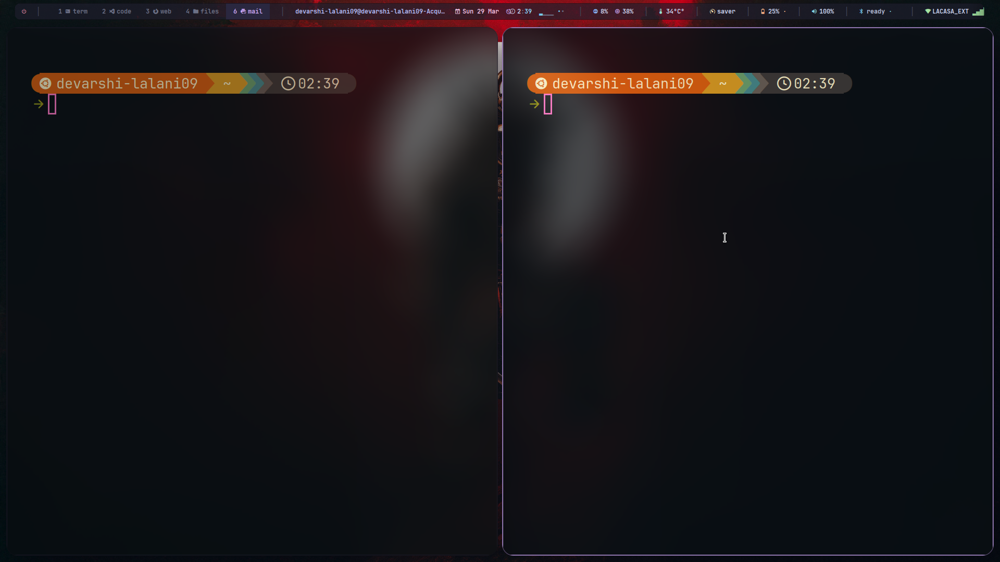
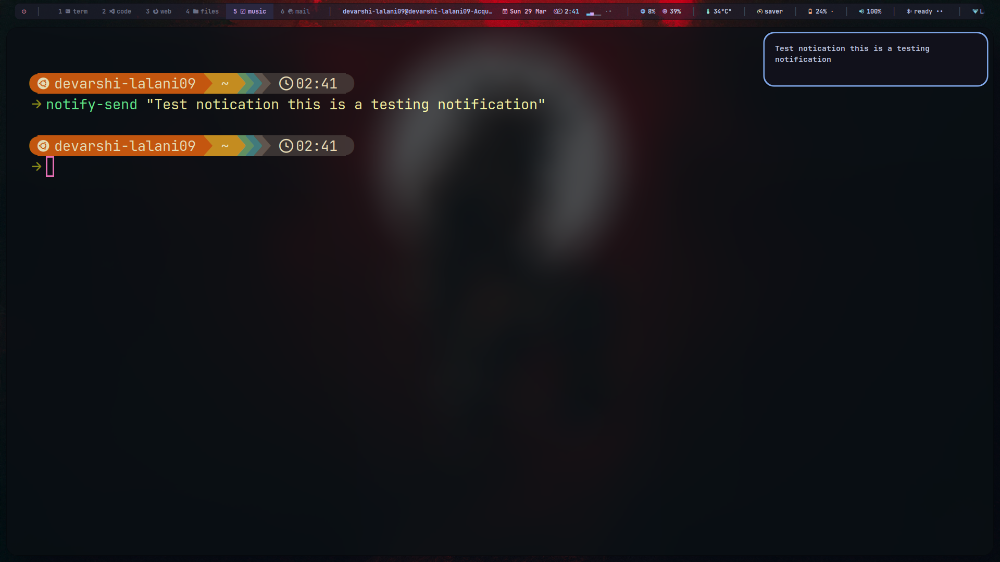
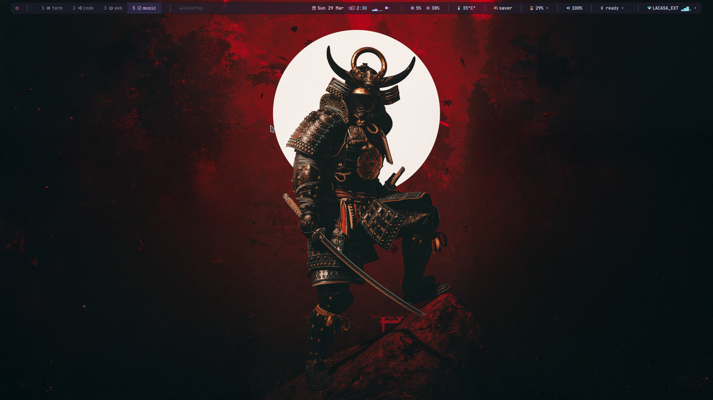

# Dotfiles

Personal Linux desktop dotfiles based on `i3`, `polybar`, `picom`, `dunst`, and JetBrains Mono Nerd Font.

This repository is a backup/copy of the original `~/.config` setup, cleaned up into a shareable form. The overall look is a Catppuccin-inspired desktop with neon terminal themes, rounded corners, transparency, blur, and a custom Polybar setup.

## Preview

### Desktop Screenshot

Add your full desktop screenshot here later:

`./assets/screenshots/desktop-main.png`

### Terminal Screenshot



### Notification Screenshot



### Bar Screenshot



If you want to add the desktop screenshot later, create or reuse this folder:

```bash
mkdir -p assets/screenshots
```

Current screenshot files used by this README:

- `assets/screenshots/terminal.png`
- `assets/screenshots/notifications.png`
- `assets/screenshots/polybar.png`

Optional extra screenshot:

- `assets/screenshots/desktop-main.png`

## Included Configs

- `i3/config` for tiling window management, workspace bindings, gaps, floating rules, and app shortcuts
- `polybar/config.ini` for the top bar with workspaces, datetime, Spotify, CPU, memory, temperature, power profile, battery, audio, Bluetooth, and Wi-Fi modules
- `polybar/scripts/` for custom Polybar modules and the launch script
- `picom/picom.conf` for blur, transparency, rounded corners, shadows, and animations
- `dunst/dunstrc` for notifications
- `kitty/kitty.conf` for a glassy neon Kitty setup
- `alacritty/alacritty.toml` for an alternative terminal configuration with the same visual direction

## Desktop Features

- `i3` workflow with gaps, scratchpad support, floating window rules, and fast keybindings
- `polybar` with custom shell scripts for battery, Wi-Fi, Bluetooth, weather, Spotify, datetime, and power profile
- `picom` glassmorphism styling with blur, neon shadows, rounded corners, and animation support
- `dunst` notifications styled to match the desktop palette
- `kitty` and `alacritty` terminal themes using `JetBrainsMono Nerd Font`

## Dependencies

Install the main packages used by this setup:

```bash
sudo pacman -S i3-wm polybar kitty alacritty dunst picom rofi feh thunar \
  network-manager-applet brightnessctl playerctl xclip xorg-xinput scrot \
  blueman jq nm-connection-editor
```

Extra tools referenced in the configs/scripts:

- `JetBrainsMono Nerd Font`
- `lxqt-policykit`
- `lxqt-sudo`
- `cpupower`
- `tlp`
- `wpctl` / PipeWire tools
- `nmcli`
- `bluetoothctl`
- `curl`
- `xrandr`
- `Papirus-Dark` icon theme

Important note:

- The `picom` config mentions `picom-pijulius-git` style features, so a regular `picom` package may not support every effect.
- The weather script calls `wttr.in`, so it needs internet access.
- The Kitty config contains a wallpaper path that should be changed for your machine.

## Installation

Back up your existing config first, then copy the files into `~/.config`.

```bash
mkdir -p ~/.config
cp -r i3 ~/.config/
cp -r polybar ~/.config/
cp -r picom ~/.config/
cp -r dunst ~/.config/
cp -r kitty ~/.config/
cp -r alacritty ~/.config/
```

Restart your session or reload the affected tools after copying:

```bash
i3-msg reload
pkill polybar && ~/.config/polybar/scripts/launch.sh
pkill dunst && dunst &
pkill picom && picom --config ~/.config/picom/picom.conf &
```

## Paths To Update

A few paths and machine-specific values should be adjusted after copying:

- In `kitty/kitty.conf`, update `background_image` to a real wallpaper path on your system
- In `i3/config`, review the touchpad device name used in the `xinput set-prop` commands
- In `polybar/scripts/weather.sh`, change `CITY="Ahmedabad"` if needed
- In `i3/config`, review any hardcoded script paths before use

## Repository Layout

```text
.
├── alacritty/
├── dunst/
├── i3/
├── kitty/
├── picom/
├── polybar/
│   └── scripts/
└── README.md
```

## Notes

- This repo is best treated as a personal dotfiles snapshot, not a one-command universal installer
- Some scripts assume an X11-based environment and may need edits for different hardware or distributions
- Both `kitty` and `alacritty` are included, so you can keep either one as your main terminal

## License

Use, modify, and adapt these dotfiles freely for personal use.
